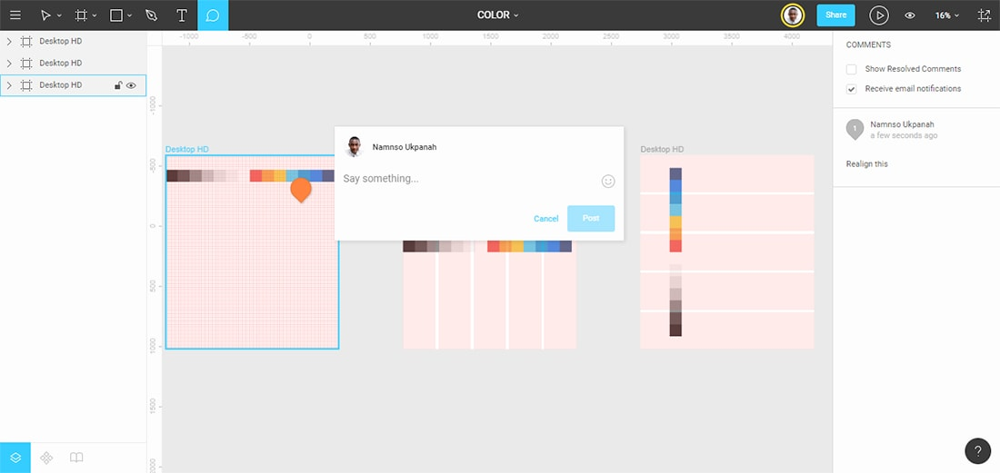
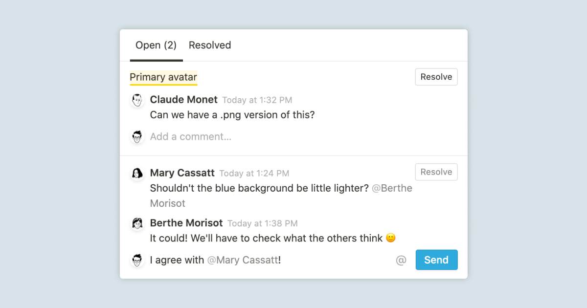
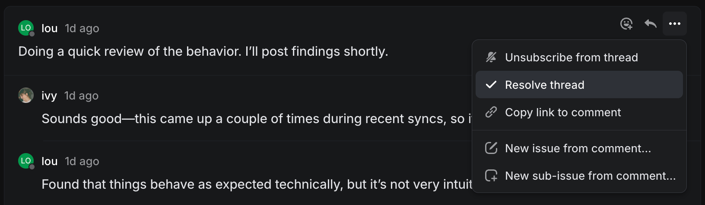
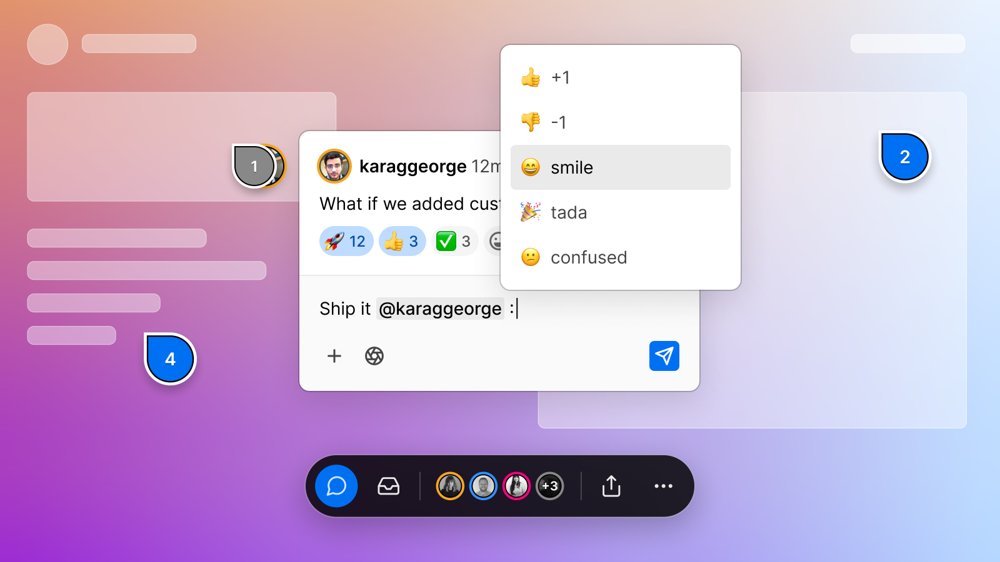
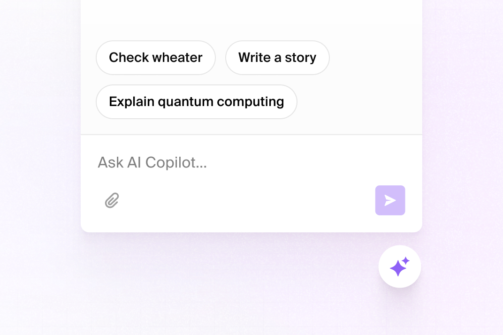

# Canvas annotations and in-app agent — research brief

**Status:** discovery complete; no implementation decision yet.

## What exists

There are two annotation primitives, with materially different visual and zoom
behaviour:

- **Attached comments** are records in a card's `comments` property. They are
  rendered as full-width, coloured blocks below the card. Their real DOM height
  becomes `commentH`, so the layout engine can leave room underneath the card.
  At zoom below 60%, the card body switches to a gist and the comment body uses
  `commentGist`, but each comment remains a full-size exterior block.
- **Floating feedback** is a separate `feedback` canvas shape. It has a small
  provenance/type row and text body, but no zoom-specific summary treatment,
  no shared visual tokens with attached comments, and resolving it simply hides
  it (`display: none`).

The in-app agent is a fixed, bottom-centre chat dialog opened with `/` outside
editable content. It has an input, a flat streamed transcript and a scope chip.
It can collapse to a status pill while a run continues. The component is
functionally mature (selection scope, cancellation, transcript preservation,
short-viewports and reduced motion are covered), but its visual model still
reads as a generic floating chat window rather than a canvas-native workbench.

## Reference captures

These are research copies of public product/documentation images. Keep the
source URL with the image; they are visual references, not product assets.

### Figma — spatial anchor

A screen-space pin locates the thread on a zoomed canvas, while the conversation
itself can live away from the artboard. [Source: Design Shack's Figma
example](https://designshack.net/articles/software/figma-tutorial/)

### Notion — thread density

Thread identity, avatar/provenance, a clear open/resolved split and a reply
affordance. [Source: Notion help](https://www.notion.com/help/guides/comments-and-discussions)

### Linear — calm activity and resolution

A quiet chronological feed: individual actions are visually subordinate to the
working object, and resolution is an explicit state. [Source: Linear
docs](https://linear.app/docs/comment-on-issues)

### Vercel — compact collaboration actions

Concise input and reaction/action chrome in a temporary collaboration context.
[Source: Vercel resource](https://vercel.com/resources)

### Liveblocks — a useful agent starting state

A light initial composer with useful suggested actions rather than an empty chat
rectangle. [Source: Liveblocks AI popup](https://liveblocks.io/examples/ai-popup/nextjs-ai-popup)

## Design principles to test

1. **One annotation language, two placements.** Attached and floating feedback
   need the same state vocabulary: open/resolved, author/reviewer, type,
   count, summary and a deliberate expansion action. Placement should change
   the anchor, not the design system.
2. **Pins are screen-legible; threads are density-managed.** At normal zoom,
   an attached comment can expand next to its card and a floating comment can
   remain a compact card. At overview zoom, neither should project a full body
   into the canvas: show a counter-scaled pin/badge plus one bounded gist or
   count. Selecting the marker opens the actual thread in a predictable,
   non-overlapping surface.
3. **Resolution is recoverable and inspectable.** Hide is not enough. Preserve
   resolved annotations in the existing review-home stack or a single
   annotation inbox, with provenance and a restore/reopen action.
4. **The agent is a task surface, not just a chat surface.** Opening it should
   communicate scope and offer 3–4 context-aware verbs. During a run, the
   primary persistent object is a compact activity/status item that keeps the
   canvas usable; the detailed transcript is expandable on demand.

## Three plausible directions

### A. Keep comments in-place; harmonise their visual system

Restyle attached cards and floating feedback with common tokens and add a
zoomed-out badge/gist to feedback. This is the smallest change, but leaves
long comment threads competing for canvas space.

### B. Recommended: markers on canvas, one inspector for threads

Both placements render a compact marker/badge in the canvas. Selecting a
marker opens one side/bottom inspector with its thread, provenance, resolve
action and expansion. The inspector is the only place with full bodies and
replies. Anchored markers live on their cards; free-floating markers retain
their canvas position. This best matches Figma's spatial cue plus Notion's
thread density, and makes overview zoom coherent.

### C. Turn annotations into a persistent review rail

Canvas markers only indicate counts; all active feedback lives in a permanent
right rail grouped by card/cluster/review. It maximises prose readability but
is a larger navigation change and can feel too document-like for free-form
canvas work.

## Recommended initial PR slices

Do not start these until the interaction direction is approved.

1. **Annotation state and zoom contract.** Define a shared presentational
   model for attached and floating annotations; make `summary` and a
   counter-scaled overview badge explicit for both. Unit-test the zoom/state
   decisions.
2. **Canvas annotation markers.** Replace full external comment blocks and
   floating feedback cards at overview zoom with non-overlapping, accessible
   markers; preserve the current layout-obstacle guarantees. Add canvas E2E
   coverage at normal and overview zoom.
3. **Annotation inspector and resolved stack.** Implement the single thread
   inspector, resolve/reopen flow and provenance, reusing the review-home
   direction already described in `2026-07-28-canvas-review-feedback-design.md`.
4. **Agent composer.** Redesign the idle `/` entry state around scope, useful
   suggested actions and a compact canvas-native composer; keep all existing
   keyboard and selection safeguards.
5. **Agent activity and transcript.** Make the collapsed status item the
   primary running state; give the expanded transcript clear event hierarchy
   and run completion/error treatment. Keep the one-run contract and current
   cancellation semantics.

## Implementation constraints and questions

- The application could not be run for a visual audit in this checkout because
  `node_modules` is absent (`concurrently` is unavailable). This brief is
  grounded in source and existing e2e specifications; agents should run
  `npm ci`, then add before/after captures to their PRs.
- Decide whether the inspector is a **right rail** (best on desktop, stable
  width) or a **bottom sheet** (keeps draft split available). The answer sets
  the task boundary for slices 2 and 3.
- Decide whether users can author/reply to comments in v1. Current comments are
  agent-authored and immutable; the proposed UI should not imply a capability
  that does not exist.
- Preserve: `/` is literal while typing, Escape does not accidentally cancel a
  run, canvas operations remain usable while a run is collapsed, and no
  annotation body may block unrelated canvas content at overview zoom.
